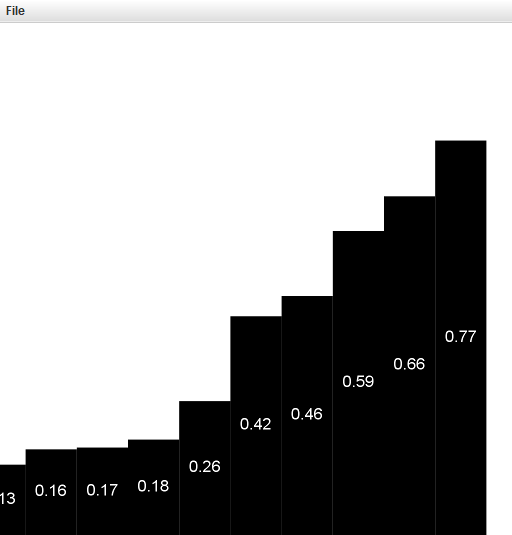

# 排序
##初级排序算法
### 选择排序

- 实现：首先找到数组中最小的元素，将它和数组的第一个元素交换位置（如果第一个元素是最小元素那它就和自己交换）。
再次，在剩下的元素中找到最小的元素，将它与数组的第二个元素交换位置。如此往复。

### 插入排序

- 实现：将一个元素插入到其他已经有序的元素的适当位置。
- 优势：对于部分有序的数组十分高效，也适合小规模数组。

### 希尔排序


> 上图为4个有序子数组，每个子数组有N/h=16/4=4个元素，元素间隔都是 h=4。

- 一个 h 有序数组就是 h 个互相独立的有序数组。
- 实现：将数组切分为 h 个子数组,每个子数组有 N/h 个元素。逐步递减h到1，排序完成。
- 优势：权衡了子数组的规模和有序性。
- 时间复杂度：运行时间达不到平方级别。


> 2.1.10在希尔排序中为什么实现h有序时不使用选择排序?

因为选择排序不能利用元素之前的次序来减少排序的时间复杂度。而插入排序可以做到这点，于是选择了插入排序。

## 排序可视化
### 矩形表示数据


示例



### 线条表示数据
```
//x0,y0,x1,y1
StdDraw.line(i * 1.0, 0.0, i * 1.0, (Double) a[i]);
```

示例


## 归并排序
- 思想：分治
- 实现：先（递归地）将数组分成两半，分别排序，然后将结果归并起来。
- 缺点：辅助数组使用的额外空间和N 的大小成正比。
- 时间复杂度：O(NlogN)

### 自顶向下的实现
调用轨迹：


### 自底向上的实现
1. 两两归并（把每个元素想象成一个大小为 1 的数组）
2. 四四归并（将两个大小为 2 的数组归并成一个有 4 个元素的数组）
3. 八八归并（将两个大小为 4 的数组归并成一个有 8 个元素的数组）
4.  ...

```
0-1 2-3 4-5 6-7 8-9 10-11 12-13 14-15
0-----3 4-----7 8------11 12-------15
0-------------7 8------------------15
0----------------------------------15
```

## 快速排序
- 思想：分治
- 优势：原地排序，时间复杂度 NlgN。
- 实现：将原数组分成两个子数组，将两部分独立地排序。

1. 先随意取a[lo]作为切分元素，然后从数组左端开始向右扫描，直到找到一个大于等于它的元素，
2. 再从数组的右端开始向左扫描直到找到一个小于等于它的元素。
3. 交换这两个元素的位置。
4. 如此继续，我们就可以保证左指针i 的左侧元素都不大于切分元素，右指针j 的右侧元素都不小于切分元素。
5. 当两个指针相遇时，将切分元素a[lo] 和左子数组最右侧的元素（a[j]）交换然后返回j 即可。

### 算法改进
- 切换到插入排序

在排序小数组时应该切换到插入排序。将 sort() 中的语句
```
if (hi <= lo) return;
```
替换成下面来对小数组使用插入排序：
```
if (hi <= lo + M) { Insertion.sort(a, lo, hi); return; }
```
转换参数M 的最佳值和系统相关，但是5 ～ 15 之间的任意值在大多数情况下都能令人满意。

- 三取样切分的快速排序

使用子数组的一小部分元素的中位数来切分数组，代价是需要计算中位数。经验是将取样大小设为3 并用大小居中的元素切分的效果最好。

- 三向切分的快速排序

优势：对于含大量重复元素的数组，它将排序时间从线性对数级降低到了线性级别。主要是优化了重复元素的问题。

将数组切分为三部分，分别对应小于、等于和大于切分元素的数组元素。


- a[i]小于 v，将 a[lt]和 a[i]交换，将 lt和 i加一；
- a[i]大于 v，将 a[gt]和 a[i]交换，将 gt减一；
- a[i]等于 v，将 i加一。


## 优先队列
### 实现
- 优先队列的基本表现形式（其一或者两种操作都能在线性时间内完成）
- 基于二叉堆数据结构的优先队列的实现（用数组保存元素并按照一定条件排序，实现对数级别的删除最大元素和插入元素操作）

### 应用
- 模拟系统，事件的键为发生的时间，需要按时间顺序处理事件
- 任务调度，键值对应的优先级决定了执行任务的优先级
- 数值计算，键值代表计算错误，需要按照键值指定的顺序来修正错误
- 通过插入一列元素然后一个个地删掉最小的元素，用优先队列实现排序算法。堆排序的重要排序算法来自于基于堆的优先队列的实现
- 使用优先队列来抽象图搜索算法
- 数据压缩算法

### 从N 个输入中找到最大的M 个元素所需成本
| 示例        | 时间 |空间 |
| ------------ | ------------------ |---|
|排序算法的用例|NlogN| N|
|初级实现的优先队列|NM| M|
|基于堆实现的优先队列|NlogM| M|

### 优先队列的各种实现在最坏情况下运行时间的增长数量级

|数据结构|插入元素|删除最大元素|
|---|---|---|
|有序数组|N| 1|
|无序数组|1 |N|
|堆|logN| logN|
|理想情况|1| 1|

### 答疑
> 问:还是不明白优先队列是做什么用的。为什么不直接把元素排序然后再一个个地引用有序数组中的元素？

> 答:在某些数据处理的例子里，比如TopM 和Multiway，总数据量太大，无法排序（甚至无法全部装进内存）。
如果你需要从10 亿个元素中选出最大的十个，你真的想把一个10 亿规模的数组排序吗？
但有了优先队列，你就只用一个能存储十个元素的队列即可。在其他的例子中，我们甚至无法同时获取所有的数据，
因此只能先从优先队列中取出并处理一部分，然后再根据结果决定是否向优先队列中添加更多的数据。

> 问:为什么不像我们在其他排序算法中那样使用Comparable 接口，而在MaxPQ 中使用泛型的Key 呢？

> 答:这么做的话delMax() 的用例需要将返回值转换为某种具体的类型，比如String。一般来说，应尽量避免在用例中进行类型转换。

## 堆
### 堆的定义
> - 当一棵二叉树的每个结点都大于等于它的两个子结点时，它被称为堆有序(最大堆)。
> - 根结点是堆有序的二叉树中的最大结点。
> - 二叉堆能够用堆有序的完全二叉树排序，并在数组中按照层级储存（不使用数组的第一个位置）。
> - 一棵大小为N 的完全二叉树的高度为(lgN 向下取整)。

在一个堆中
- 位置k 的结点的父结点的位置为k/2，它的两个子结点的位置分别为2k 和2k+1。
- 通过计算数组的索引在树中上下移动：从a[k] 向上一层就令k 等于k/2，向下一层则令k 等于2k 或2k+1。

堆的表示


### 堆的算法
用长度为N+1 的私有数组pq[] 来表示大小为N 的堆，不使用pq[0]， 堆元素放在pq[1] 至pq[N] 中。

- 由下至上的堆有序化（上浮）

如果堆的有序状态因为某个结点变得比它的父结点更大而被打破，需要通过交换它和它的父结点来修复堆。
```
private void swim(int k){
    while (k > 1 && less(k/2, k)){
        exch(k/2, k);
        k = k/2;
    }
}
```


- 由上至下的堆有序化（下沉）

如果堆的有序状态因为某个结点变得比它的两个子结点或其中之一更小而被打破，通过将它和它的两个子结点中的较大者交换来恢复堆。
```
    private void sink(int k)
    {
        while (2*k <= N)
        {
            int j = 2*k;
            if (j < N && less(j, j+1)) j++; // j最后的值表示两个子节点中最大的那个的索引。j<N是为了避免索引越界
            if (!less(k, j)) break;// 如果 k位置的值大于等于子节点中最大的那个，表示堆调整完成，退出循环。
            exch(k, j); // 将父节点和子节点中最大的那个交换值。
            k = j;//此时j是上一轮三者（父节点，两个子节点）中最小的节点的位置，赋值给k继续下一轮循环。
        }
    }
```


> 一个形象的比喻。
swim() 表示一个很有能力的新人加入组织并被逐级提升（将能力不够的上级踩在脚下），直到他遇到一个更强的领导。
sink() 类似于整个社团的领导退休并被外来者取代后，如果他的下属比他更厉害，角色就会交换，交换会持续下去直到他的能力比其下属都强。

- 插入元素

将新元素加到数组末尾，增加堆的大小，并让这个新元素上浮到合适的位置。


- 删除最大元素

从数组顶端删去最大的元素，并将数组的最后一个元素放到顶端，减小堆的大小，并让这个元素下沉到合适的位置。


> 保证插入元素和删除最大元素这两个操作的用时和队列大小成对数关系。

- 多叉堆
三叉树：对于数组中1 至N 的N 个元素，位置k的结点大于等于位于3k-1、3k 和3k+1 的结点，小于等于位于(k+1)/3(向下取整)的结点。

对于给定的d，修改为任意的d 叉树也不难。我们需要在树高($$log_dN$$)和在每个结点的d 个子结点找到最大者的代价之间找到折中。
> d越大，树高越小（观察$$log_dN$$图像），但是在每个结点的d 个子结点找到最大者的时间越长。

- 调整数组大小

可以添加一个没有参数的构造函数，在insert()中添加将数组长度加倍的代码，在delMax()中添加将数组长度减半的代码。

- 索引优先队列

IndexMinPQ

### 堆排序
步骤：
1. 建堆
2. 交换元素
3. 调整堆


## 排序的稳定性
如果一个排序算法能够保留数组中重复元素的相对位置，则称该排序算法是稳定的。

- 稳定：插入排序、归并排序
- 不稳定：选择排序、希尔排序、快速排序、堆排序

### 选择排序的不稳定性
- 第一轮：[5, 8, 5, 2, 9]
- 第二轮：[2, 8, 5, 5, 9]

其中两个5之间的相对位置已经变化。

## 总结

各种排序算法的性能特点

|算　　法 |是否稳定 |是否为原地排序| 时间复杂度| 空间复杂度| 备　　注|
|---|---|---|---|---|----|
|选择排序 |否 |是| N^2 | 1| |
|插入排序| 是 |是| 介于N 和N^2 之间| 1 |取决于输入元素的排列情况|
|希尔排序| 否| 是 | NlogN? N^(6/5)?| 1||
|快速排序 |否 |是 |NlogN |lgN |运行效率由概率提供保证|
|三向快速排序| 否| 是 |介于N 和NlogN之间| lgN |运行效率由概率保证，同时也取决于输入元素的分布情况|
|归并排序 |是 |否| NlogN |N|
|堆排序 |否 |是| NlogN |1|

java.util.Arrays.sort() 实现使用的是三向快速排序和归并排序。