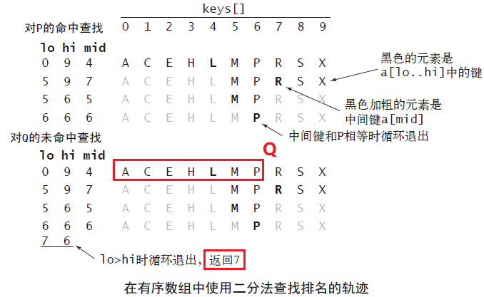
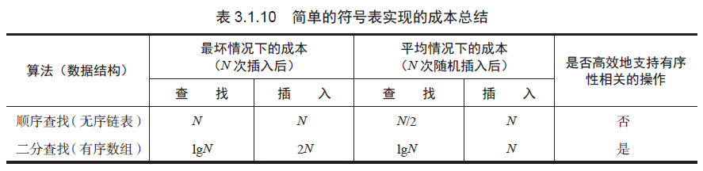

# 符号表
## 简单的泛型符号表API
```
public class ST<Key, Value>
ST()                         创建一张符号表
void put(Key key, Value val) 将键值对存入表中（若值为空则将键key 从表中删除）
Value get(Key key)           获取键key 对应的值（若键key 不存在则返回null）
void delete(Key key)         从表中删去键key（及其对应的值）
boolean contains(Key key)    键key 在表中是否有对应的值
boolean isEmpty()            表是否为空
int size()                   表中的键值对数量
Iterable<Key> keys()         表中的所有键的集合
```
- 键不能为null，并且不能重复
- 不允许有空值
- put(key, null) 是delete(key) 的一种简单的（延时型）实现
- 建议使用不可变的数据类型作为key，否则表的一致性无法保证

### 实现：SequentialSearchST

## 有序的泛型符号表的API
```
public class ST<Key extends Comparable<key>, Value>
ST()                                创建一张有序符号表
void put(Key key, Value val)        将键值对存入表中（若值为空则将键key 从表中删除）
Value get(Key key)                  获取键key 对应的值（若键key 不存在则返回空）
void delete(Key key)                从表中删去键key（及其对应的值）
boolean contains(Key key)           键key 是否存在于表中
boolean isEmpty()                   表是否为空
int size()                          表中的键值对数量
Key min()                           最小的键
Key max()                           最大的键
Key floor(Key key)                  小于等于key 的最大键，类似于实数向下取整
Key ceiling(Key key)                大于等于key 的最小键，类似于实数向上取整
int rank(Key key)                   小于key 的键的数量
Key select(int k)                   排名为k 的键
void deleteMin()                    删除最小的键
void deleteMax()                    删除最大的键
int size(Key lo, Key hi)            [lo..hi] 之间键的数量
Iterable<Key> keys(Key lo, Key hi)  [lo..hi] 之间的所有键，已排序
Iterable<Key> keys()                表中的所有键的集合，已排序
```
- 在符号表为空时，min()、max()、deleteMin()、deleteMax()、floor() 和ceiling() 会抛出NoSuchElementException异常
- 当k<0 或k>=size() 时，select(k) 会抛出索引越界异常
- 对于0 到size()-1 的所有i，都有i==rank(select(i))，且所有的键都满足key==select(rank(key))

### 有序符号表中冗余有序性方法的默认实现
```
void deleteMin()            delete(min());
void deleteMax()            delete(max());
int size(Key lo, Key hi)    if (hi.compareTo(lo) < 0)
                              return 0;
                            else if (contains(hi))
                              return rank(hi) - rank(lo) + 1;
                            else
                              return rank(hi) - rank(lo);
Iterable<Key> keys()        return keys(min(), max());
```

### 键的等价性
维护所有Comparable 类型中compareTo() 方法和equals() 方法的一致性。
任何一种Comparable 类型的两个值a 和b 都要保证(a.compareTo(b)==0)和a.equals(b) 的返回值相同。

### 实现：BinarySearchST

BinarySearchST 的操作的成本
```
方法        运行所需时间的增长数量级
put()       N
get()       logN
delete()    N
contains()  logN
size()      1
min()       1
max()       1
floor()     logN
ceiling()   logN
rank()      logN
select()    1
deleteMin() N
deleteMax() 1
```

rank()的实现原理：有序数组中的二分查找。返回左下标lo



逐个保存 S E A R C H E X A M P L E 序列的运行过程
```
[S 0] 
[E 1] [S 0] 
[A 2] [E 1] [S 0] 
[A 2] [E 1] [R 3] [S 0] 
[A 2] [C 4] [E 1] [R 3] [S 0] 
[A 2] [C 4] [E 1] [H 5] [R 3] [S 0] 
[A 2] [C 4] [E 6] [H 5] [R 3] [S 0] 
[A 2] [C 4] [E 6] [H 5] [R 3] [S 0] [X 7] 
[A 8] [C 4] [E 6] [H 5] [R 3] [S 0] [X 7] 
[A 8] [C 4] [E 6] [H 5] [M 9] [R 3] [S 0] [X 7] 
[A 8] [C 4] [E 6] [H 5] [M 9] [P 10] [R 3] [S 0] [X 7] 
[A 8] [C 4] [E 6] [H 5] [L 11] [M 9] [P 10] [R 3] [S 0] [X 7] 
[A 8] [C 4] [E 12] [H 5] [L 11] [M 9] [P 10] [R 3] [S 0] [X 7] 
```
可以看到，该符号表始终维护者Key的有序性，因此可以获得良好的查找性能，但是较差的插入性能。

## 简单的符号表实现的成本总结
表中给出的是总成本中的最高级项（对于二分查找是数组的访问次数，对于其他则是比较次数），即运行时间的增长数量级。



- 为了良好的插入性能，一开始选择顺序查找（无序链表）的实现。但单向链表无法使用二分查找法，所以查找性能很差。
  - 二分查找的高效来自通过索引取得任何子数组的中间元素（但得到一条链表的中间元素的唯一方法是链表遍历，即使是快慢双指针）
- 为了良好的查找性能，选择了二分查找（有序数组）的实现。但是，数组的插入性能相比于链表较差。

为了将二分查找的效率和链表的灵活性结合，需要更加复杂的数据结构。能够同时拥有两者的就是二叉查找树。

## 符号表的各种实现的优缺点
|使用的数据结构|实现|优点|缺点|
|---|---|---|---|
|链表（顺序查找）| SequentialSearchST |适用于小型问题|对于大型符号表很慢|
|有序数组（二分查找）|BinarySearchST|最优的查找效率和空间需求，能够进行有序性相关的操作|插入操作很慢|
|二叉查找树|BST　|实现简单，能够进行有序性相关的操作|没有性能上界的保证,链接需要额外的空间|
|平衡二叉查找树|RedBlackBST| 最优的查找和插入效率，能够进行有序性相关的操作|链接需要额外的空间|
|散列表|SeparateChainHashST LinearProbingHashST|能够快速地查找和插入常见类型的数据|需要计算每种类型的数据的散列,无法进行有序性相关的操作,链接和空结点需要额外的空间|