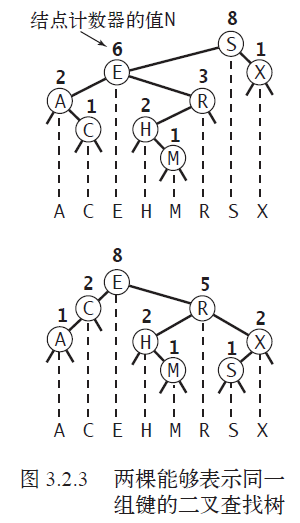
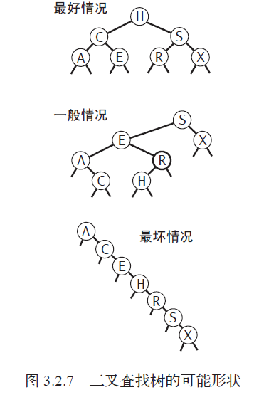
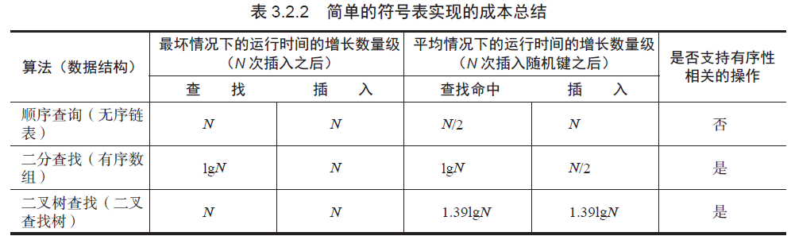
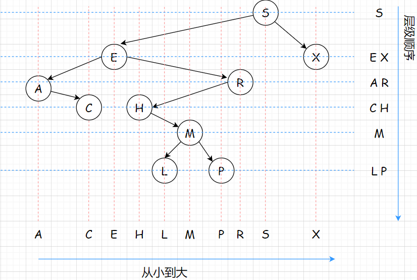

# 二叉查找树
## 灵活性
天然有序。

## 查找
- 如果树是空的，则查找未命中；
- 如果被查找的键和根结点的键相等，查找命中；
- 否则递归地在适当的子树中继续查找。
  - 如果被查找的键较小就选择左子树，
  - 较大则选择右子树。
  
## 插入
.png)

## 递归的想象
- 将递归调用前的代码想象成沿着树向下走↓：它会将给定的键和每个结点的键相比较并根据结果向左或者向右移动到下一个结点。
- 将递归调用后的代码想象成沿着树向上爬↑。

get和put
- 对于get() 方法，对应着一系列的返回指令 return 。
- 对于put() 方法，对应着重置搜索路径上的根节点，并更新当前根节点的计数器的值。

## 生长分析

使用二叉查找树的算法的运行时间取决于树的形状，而树的形状取决于键被插入的先后顺序。
- 最好的情况，一棵含有N 个结点的树完全平衡，每条空链接和根结点的距离都为 ～ lgN。
- 最坏的情况，搜索路径上可能有N个结点。

二叉查找树和快速排序很类似。树的根结点就是快速排序中的第一个切分元素（左侧的键都比它小，右侧的键都比它大），这对于所有的子树同样适用。

## 跟有序性相关的操作
### 最大键和最小键
最大键 max()
- 从根节点开始
- 如果根结点的右链接为空，那么该二叉查找树中最大的键就是根结点；
- 如果右链接非空，那么树中的最大键就是右子树中的最大键。递归算法。

最小键 min()
- 从根节点开始
- 如果根结点的左链接为空，那么该二叉查找树中最小的键就是根结点；
- 如果左链接非空，那么树中的最小键就是左子树中的最小键。递归算法。

### 向上取整和向下取整
.png)

向下取整 floor()
- 如果给定的键key 等于二叉查找树的根结点的键，直接返回根节点的键。
- 如果给定的键key 小于二叉查找树的根结点的键，那么小于等于key 的最大键floor(key) 一定在根结点的左子树中；
- 如果给定的键key 大于二叉查找树的根结点的键，那么只有当根结点右子树中存在小于等于key 的结点时，小于等于key 的最大键才会出现在右子树中，
否则根结点就是小于等于key的最大键。

向上取整 ceiling()
- 如果给定的键key 等于二叉查找树的根结点的键，直接返回根节点的键。
- 如果给定的键key 小于二叉查找树的根结点的键，那么只有当根结点左子树中存在大于等于key 的结点时，大于等于key 的最小键才会出现在左子树中，
否则根结点就是大于等于key的最小键。
- 如果给定的键key 大于二叉查找树的根结点的键，那么大于等于key 的最小键ceiling(key) 一定在根结点的右子树中。

### 选择 select()
在二叉查找树的每个结点中维护的子树结点计数器变量N 就是用来支持此操作。

想找到排名为k 的键（即树中正好有k 个小于它的键）。
> 理解：如果k=0，代表它最小，在第一位；如果k=1，代表有一个比它小，它在第二位。以此类推。

过程步骤：
- 如果左子树中的结点数leftSize 等于k，直接返回根结点中的键；
- 如果leftSize 大于k，继续（递归地）在左子树中查找排名为k 的键；
- 如果leftSize 小于k，我们就（递归地）在右子树中查找排名为（k-leftSize-1）的键。

过程例子：

.png)

A C E H ...中H Index为3
### 排名 rank()
rank() 是select() 的逆方法，会返回给定键的排名。rank() 的实现和select() 类似：
- 如果给定的键和根结点的键相等，我们返回左子树中的结点总数t；
- 如果给定的键小于根结点，我们会返回该键在左子树中的排名（递归计算）；
- 如果给定的键大于根结点，我们会返回t+1（左子树节点t+根结点1）加上它在右子树中的排名（递归计算）。

### 删除操作
#### 删除最小键
deleteMin()，可以想象为一直往左走
- 不断深入根结点的左子树中直至遇见一个空链接
- 然后将指向该结点的链接指向该结点的右子树（只需要在递归调用中返回它的右链接）
- 更新节点计数器

.png)

#### 删除最大键
deleteMax()，可以想象为一直往右走
- 不断深入根结点的右子树中直至遇见一个空链接
- 然后将指向该结点的链接指向该结点的左子树（只需要在递归调用中返回它的左链接）
- 更新节点计数器

#### 一般删除
可以用类似的方式删除任意只有一个子结点（或者没有子结点）的结点，但删除一个拥有两个子结点的结点比较复杂。

- 解决方案：在删除结点x 后用它的后继结点填补该空位。
- 证明：因为x 有一个右子结点，因此它的后继结点就是其右子树中的最小结点。这样的替换能够保证树的有序性。

.png)

- 步骤
  - 将指向即将被删除的结点的链接保存为 t；
  - 将 x 指向它的后继结点 min(t.right)；
  - 将 x 的右链接指向 deleteMin(t.right)，也就是在删除后所有结点仍然都大于x.key 的子二叉查找树；
  - 将 x 的左链接（本来为空）设为 t.left（其下所有的键都小于被删除的结点和它的后继结点）
  
- 潜在的性能问题

>这种方法能够正确地删除一个结点，缺陷是可能会产生性能问题。这个问题在于选用后继结点是一个随意的决定，且没有考虑树的对称性。可以使用它的前趋结点吗？
实际上，前趋结点和后继结点的选择应该是随机的。

### 范围查找
要实现能够返回给定范围内键的keys() 方法，需要一个遍历二叉查找树的基本方法，叫做中序遍历。可以理解为按从小到大排序。

1. 打印根结点的左子树中的所有键（都小于根结点的键），
2. 打印根结点的键，
3. 打印根结点的右子树中的所有键（都大于根结点的键）。

.png)

实现步骤：private void keys(Node x, Queue<Key> queue, Key lo, Key hi)
- lo < x.key，而且x左子树 < x.key，于是递归x左子树
- lo <= x.key <= hi，那么x.key合适，入列
- x.key < hi，而且x.key< x右子树，于是递归x右子树

### 性能分析
给定一棵树，树的高度决定了所有操作在最坏情况下的性能（范围查找除外，因为它的额外成本和返回的键的数量成正比）。

>命题E。在一棵二叉查找树中，所有操作在最坏情况下所需的时间都和树的高度成正比。
>
>证明。树的所有操作都沿着树的一条或两条路径行进。根据定义，路径的长度不可能大于树的高度。

二叉查找树的基本实现的良好性能依赖于键的分布足够随机以消除长路径。
- 对于快速排序，可以先将数组打乱；
- 而对于符号表的API，无能为力，因为符号表的用例控制着各种操作的先后顺序。

换言之，将所有键按照顺序或者逆序插入符号表会增加最坏情况出现的概率，而在没有明确的警告来避免这种行为时有些用例肯定会尝试这么做。

## 用例测试

