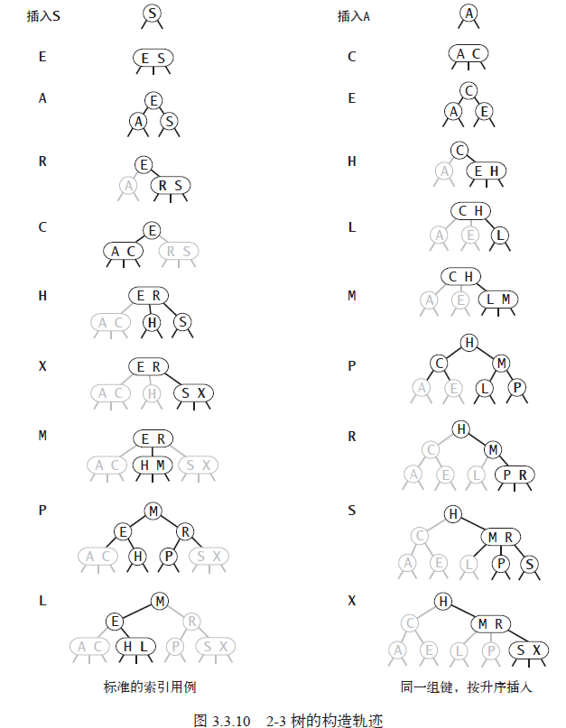
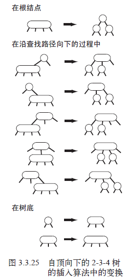

# 平衡查找树
一般的二叉树实现，因为会受到用例输入的影响，树的生长可能会发育不良，长歪。

我们希望保持二分查找树的平衡性。在一棵含有N 个结点的树中，希望树高为~lgN，这样就能保证所有查找都能在~lgN次比较内结束，就和二分查找一样。

**难点在于，在动态插入中保证树的完美平衡并不容易。**

## 2-3 查找树
将一棵标准的二叉查找树中的结点称为2- 结点（含有一个键和两条链接），而现在我们引入3- 结点。它含有两个键和三条链接。
2- 结点和3- 结点中的每条链接都对应着其中保存的键所分割产生的一个区间。

### 定义
一棵2-3 查找树，要么为一棵空树，要么由以下结点组成：
- 2- 结点，含有一个键（及其对应的值）和两条链接，左链接指向的 2-3 树中的键都小于该结点，右链接指向的2-3 树中的键都大于该结点。
- 3- 结点，含有两个键（及其对应的值）和三条链接，左链接指向的 2-3 树中的键都小于该结点，
中链接指向的2-3 树中的键都位于该结点的两个键之间，右链接指向的2-3树中的键都大于该结点。
- 指向一棵空树的链接称为空链接。

完美平衡：一棵完美平衡的2-3 查找树中的所有空链接到根结点的距离相同。

### 查找
判断一个键是否在树中
- 先将它和根结点中的键比较。如果它和其中任意一个相等，查找命中；
- 否则根据比较的结果找到指向相应区间的链接，并在其指向的子树中递归地继续查找。
- 如果这是个空链接，查找未命中。

### 向2- 结点中插入新键
思路：在2-3 树中插入一个新结点，先进行一次未命中的查找，然后把新结点挂在树的底部。

如果未命中的查找结束于一个2- 结点，只要把这个2-结点替换为一个3- 结点，将要插入的键保存在其中。树依然保持平衡。

### 向一棵只含有一个3- 结点的树插入新键
- 这个3- 结点已经没有可插入新键的空间。
- 为了将新键插入，先临时将新键存入该结点中，使之成为一个4- 结点。这样，目前这个结点含有3 个键和4 条链接。
- 然后，将它转换为一棵由3 个2- 结点组成的2-3 树，
  - 其中一个结点（根）含有中键，
  - 一个结点含有3 个键中的最小者（和根结点的左链接相连），
  - 一个结点含有3 个键中的最大者（和根结点的右链接相连）。

这棵树是一棵含有3 个结点的二叉查找树，也是一棵完美平衡的2-3树，其中所有的空链接到根结点的距离相等。插入前树高度为0，插入后树高度为1。

### 向一个父结点为2- 结点的3- 结点中插入新键
这时，需要在维持树的完美平衡的前提下为新键腾出空间。

先临时构造4- 结点并将其分解，但不要为中键创建一个新结点，而是将中键移动至原来的父结点中。

这个过程是2-3树的动态变化的核心。

### 向一个父结点为3- 结点的3- 结点中插入新键

要插入新键的结点为3- 结点，这个结点的父结点也是3- 结点。

插入过程分析
- 在当前3- 结点，构造一个临时的4- 结点并分解它，然后将它的中键插入它的父结点中。
- 由于它的父结点也是3- 结点，因此继续用这个中键构造一个新的临时4- 结点，然后在这个结点上进行相同的变换，
即分解这个父结点并将它的中键插入到它的父结点中去。
- 就这样，一直向上不断分解临时的4- 结点并将中键插入更高层的父结点，直至遇到
  - 一个2- 结点并将它替换为一个不需要继续分解的3- 结点，此时可以结束。
  - 或者是到达3- 结点的根。那么根结点最终变成一个临时的4- 结点，接下来怎么办呢？
  此时可以按照向一棵只有一个3- 结点的树中插入新键的方法处理这个问题。将临时的4-结点分解为3 个2- 结点，使得树高加1。
  

### 局部变换

将一个4- 结点分解为一棵2-3 树有6 种可能，这个4- 结点可能是
- 根结点
- 一个2- 结点的左子结点
- 一个2- 结点的右子结点
- 一个3- 结点的左子结点
- 一个3- 结点的中子结点
- 一个3- 结点的右子结点

每个变换会将4- 结点中的一个键送入它的父结点，并重构相应的链接而不必涉及树的其他部分。

### 全局性质

- 和标准的二叉查找树由上向下生长不同，2-3 树的生长是由下向上的。（提示：临时4- 结点的变换会将一个中键送入它的父结点。）
- 在二叉查找树中，按照升序插入10 个键会得到高度为9 的一棵最差查找树。如果使用2-3 树，树的高度是2。见下图。
- 当根结点被分解为3 个2- 结点时，所有空链接到根结点的路径长度才会加1。
- 理解所有局部变换都不会影响整棵树的有序性和平衡性是理解这个算法的关键。
- 在符号表的实现中，由于无法控制用例向表中插入键的顺序，因此对最坏情况的分析是唯一能够提供性能保证的办法。

>命题F。在一棵大小为N 的2-3 树中，查找和插入操作访问的结点必然不超过lgN 个。
>
>证明。一棵含有N 个结点的2-3 树的高度在⌊log3N⌋=⌊(lgN)/(lg3)⌋（如果树中全是3- 结点）和⌊lgN⌋（如果树中全是2-结点）之间。

- 含有10 亿个结点的一棵2-3 树的高度仅在19 到30之间。最多只需要访问30个结点就能在10亿个键中进行任意查找和插入操作，相当惊人。
> lgN 1000000000	 ＝ 29.897353。lgN表示2为底。

2-3树的构造轨迹

### 实现的难度
- 需要维护两者不同类型的结点。2-和3-类型。
- 将链接和其他信息从一个结点复制到另一个结点。
- 结点类型之间的变换。
- ...

因此，需要寻找另一种简约的实现。

## 红黑二叉查找树

### 替换3- 节点
使用标准二叉树（完全是2-结点）和一些额外信息（替换3-节点）来表示2-3树。

树的链接有两种：
- 红链接：将两个2-结点连接起来构成3-结点。一条左斜的红色链接。
- 黑链接：2-3树中的普通链接。

### 等价的定义
红黑链接满足以下约束：
- 红色链接都是左链接
- 不存在一个结点，能同时和两条红链接相连
- 整棵树完美黑色平衡（也称黑高平衡）。即任意空链接到根结点路径上的黑链接数量相同。

### 一一对应
为何红黑树可以和2-3树一一对应？
- 将一个红黑树的红链接画平，那么所有的空链接到根结点的距离都是相等的。
  - 如何理解：画平之后，计算距离时，忽略红色链接，红色链接不计入距离。
  

- 如果将红链接相连的节点合并，合并之后视为3-节点，那么就能得到2-3树。
- 相反，如果将2-3树的3-结点看成红色链接相连的两个2-结点，那么不会存在同时与两个红色链接相连的结点。因此完美黑色平衡。
  - 证明：仔细观察，红色链接都是从3-结点内部分裂出来展平的，分裂前它的周围全是黑色链接。于是必然会存在黑色链接将红色链接隔开。

### 颜色表示
- 一个结点的颜色定义：它的父结点和它之间的链接的颜色。
- 在Node结构中使用布尔变量表示结点颜色。红色为true，黑色为false，空链接视为黑色。

### 旋转
**在实现的某些操作中，可能会出现红色右链接，或者两条连续的红链接。**
这时需要旋转以修复树的有序性和完美平衡性。分为左旋转和右旋转。

左旋转：红色右链接转化为红色左链接。

左旋转步骤解析
- 开始时，较小的E作为局部根节点，E的右子树为S
- 左旋后，S成为新的局部根节点，E作为S的左子树。

>代码 h = rotateLeft(h); 将旋转h的红色右链接，然后将h指向旋转后的子树的根节点。
>也就是旋转后，x赋值给h。这种递归操作仅仅改变了局部子树的根节点。这一点需要深刻理解。

右旋转：红色左链接转化为红色右链接。

右旋转步骤解析
- 开始时，较大的S作为局部根节点，S的左子树为E。
- 右旋后，E成为新的局部根节点，S成为E的右子树。

无论是左旋转还是右旋转，都会返回新的局部根节点x。可以使用这个返回值x来重置对应的链接。

### 向单个2- 结点的树插入新键
一颗只有一个键的红黑树只含有一个2-结点。插入新键后
- 如果新键 < 老键，结点放于左边，之间的链接为红色左链接。
- 如果新键 > 老键，结点放于右边，之间的链接为红色右链接。此时需要左旋。
root=rotateLeft(root) => 将红色右链接改为红色左链接，并重置根节点。

结果是得到一颗与只有一个3-结点等价的红黑树。树高为1，一条红左链接，两个键。

### 向树底部的2- 结点插入新键
策略：总是使用红链接将新结点和它的父结点相连。讨论它的2- 父结点
- 指向新结点的是父结点的左链接，那么该父结点直接成为3- 结点即可。此时红左链接保证了平衡性。
- 指向新结点的是父结点的右链接，此时需要一次左旋即可修正。

### 向单个3- 结点的树插入新键
根据键的大小关系，划分三种可能：新建小于树的两键，在两键之间，大于两键。
每种情况都会产生一个同时连接到两个红链接得结点，必须修复这一点。

- ①新键 > 原树两键，因此新键连接到3-结点的右链接。此时树平衡，根节点为中间大小的键，
中键有两条红链接分别和较小和较大的键相连。此时将两条红链接改为黑色，平衡性就得以修复。
这种情况0次旋转，只需要变色。

- ②新键 < 原树两键，因此新键连接到3-结点的左链接。产生两条连续的红链接。
此时只需要将上层的红链接右旋转即可得到①情况，根据①的做法处理。
这种情况1次右旋。

- ③新键介于原树两键之间，产生两条连续的红链接。只需要将下层的红链接左旋即可得到②情况。
这种情况先1次左旋，然后1次右旋。

### 颜色转换
flipColors用于转换一个结点的两个红色子节点的颜色。
- 将两个子结点由红改黑。
- 将当前结点由黑改红。
- 这是局部变换，不会影响整棵树平衡性。

.png)

### 根节点总是黑色
[向单个3- 结点的树插入新键]的描述中，会产生根节点为红色。

约定: 每次插入后重置根节点为黑色。当根节点由红变黑时，树高加1。

### 向树底部的3-结点插入新键
指向新结点的链接可能是
- 3- 结点的右链接，参考[向单个3- 结点的树插入新键]情况①。这种情况0次旋转，然后变色。
- 3- 结点的左链接，参考[向单个3- 结点的树插入新键]情况②。这种情况1次右旋，然后变色。
- 3- 结点的中链接，参考[向单个3- 结点的树插入新键]情况③。这种情况先1次左旋，然后1次右旋，然后变色。

也就是，向树底部的3-结点插入新键，归结于[向单个3- 结点的树插入新键]的相同处理。

注意：颜色转换会使得中结点变红，相当于把中结点送入父结点。（提示：变红的中结点，视为3-结点的一部分）。
也就是说，在父结点插入了一个新键。

总结一下：向树底部的3-结点插入新键 => 分解3- 结点，将中结点插入父结点。上图中，中结点R被送入父结点E，与E形成红右链接。

### 将红链接在树中向上传递
要在3- 结点插入新键的步骤（红黑树插入算法的核心）：
- 创建临时4- 结点
- 分解4- 结点，并将红链接由中结点传递给父结点
- 重复这个过程，直到遇到2- 结点或者根节点。

总结：使用左旋转、右旋转、变色这三个操作，就能精心维护红黑树和2-3树的一一对应关系。

- h.right为红，并且h.left为黑，左旋
- h.left为红，并且h.left.left为红，右旋
- h.left为红，h.right为红，变色，并将中结点向上提交。

### 算法实现
> RedBlackBST

- put()非常复杂
- deleteMin()、deleteMax()、delete()实现更加复杂。

### 测试用例

## 2-3树的删除操作
要描述删除操作，先回到2-3树。

### 自顶向下的2-3-4树

2-3-4树的插入算法
- 沿着查找路径向下进行变换，是为了保证当前结点不是4-结点（这样才有空位插入新键）
- 沿着查找路径向上进行变换，是为了将之前创建的4-结点配平。（保持平衡）

过程描述
- 根结点是4-结点，分解为三个2-结点，树高加1。
- 向下查找过程中，如果遇到父结点为2-结点的4-结点，将4-结点分解为两个2-结点，将中键提交给父结点，
让父结点成为3-结点
- 向下查找过程中，如果遇到父结点为3-结点的4-结点，将4-结点分解为两个2-结点，将中键提交给父结点，
让父结点成为4-结点
- 不必担心会遇到父结点为4- 结点的4- 结点，插入算法本身保证这种情况不会出现。
- 到达树底部之后，只会遇到2- 结点或者3- 结点，所以可以插入新的键。

红黑树（2-3树表示）如何实现这个算法：
- 将 4- 结点表示为由三个 2- 结点组成的一棵平衡的子树，根结点和两个子结点都用红链接相连；
- 在向下的过程中分解所有 4- 结点并进行颜色转换；
- 和插入操作一样，在向上的过程中用旋转将4-结点配平。

只需要移动算法3.4 的put() 方法中的一行代码就能实现2-3-4 树中的插入操作：
将flipColors() 语句（及其if 语句）移动到递归调用之前（null 测试和比较操作之间）。

### 删除最小键
- 最小键肯定位于底部
- 注意到，从底部的3-结点中删除键很简单，直接删除就行，不会破坏平衡。
- 但是从底部的2- 结点中删除键很难，因为删除后会留下空位○，破坏平衡。
- 于是，为了实现简单，我们不会删除一个2-结点，而是沿着左链接向下变换，在3-结点或者临时4-结点中进行删除键。

下面是讨论，如果
- 根结点是2-结点，而且它的两个子结点也是2-结点，那么将这三个2-结点合并为临时4-结点。
- 否则，需要保证根结点左子结点不是2-结点。如何保证？必要时从根节点的右侧兄弟中偷一个结点过来。
  - 当前结点的左子结点不是 2- 结点，完成。
  - 当前结点的左子结点是 2- 结点，而它的亲兄弟结点不是 2- 结点，从左子结点的兄弟结点
    中偷一个键移动到左子结点中，原文并没有描述清楚接下来的操作?；
  - 当前结点的左子结点和它的亲兄弟结点都是2- 结点，将左子结点、父结点中的最小键
    和左子结点最近的兄弟结点合并为一个4- 结点，使父结点由3- 结点变为2- 结点或者由4-
    结点变为3- 结点。
- 在遍历过程中执行这个过程，最后能得到一个含有最小键的3- 结点或者4- 结点，然后就可
以直接从中将其删除，将3- 结点变为2- 结点，或者将4- 结点变为3- 结点。这时，删除完毕。
然后再回头向上分解所有临时的4- 结点，为了保持平衡。

.png)

结论：删除黑色叶子结点难处在于会破坏黑高平衡，所以总是选择删除红色叶子结点。只要保证最终删除的结点一定是红色，就不用担心黑高平衡的破坏。

### 删除操作
在查找路径上进行和删除最小键相同的变换可以**保证在查找过程中任意当前结点均不是2- 结点**。
- 如果被查找的键在树的底部，可以直接删除它。
- 如果被查找的键不在树的底部，需要将它和它的后继结点交换，就和二叉查找树一样。

因为当前结点必然不是2- 结点，问题转化为在一棵根结点不是2- 结点的子树中删除最小的键，
可以在这棵子树中使用前文所述的算法。删除之后需要向上回溯并分解余下的4- 结点。

应该认识到这些方法的重要性，这是我们见过的第一种能够同时实现高效查找、插入和删除操作的符号表实现。

> 重要：作者在书中的思路是容易理解的，然后代码实现却不一致，关键的双红矛盾也没说清楚。建议红黑树的删除操作，查阅其他文档。

## 红黑树的性质
研究红黑树的性质就是要检查对应的2-3 树并对相应的2-3 树进行分析的过程。

最终结论：**所有基于红黑树的符号表实现都能保证操作的运行时间为对数级别**（范围查找除外，它所需的
额外时间和返回的键的数量成正比）。

### 性能分析
无论键的插入顺序如何，红黑树几乎是完美平衡。

>命题G。一棵大小为N 的红黑树的高度height不会超过2lgN。
>
>简略证明。红黑树的最坏情况是它所对应的2-3 树中构成最左边的路径结点全部都是3- 结点
而其余均为2- 结点。最左边的路径长度是只包含2- 结点的路径长度（～ lgN）的两倍。

>命题H。一棵大小为N 的红黑树中，根结点到任意结点的平均路径长度为∼ 1.00lgN。
>证明。思路是通过大量实验和数据集测试求证。

红黑树的get() 方法不会检查结点的颜色，平衡性相关的操作不会产生任何负担；
因为树是几乎平衡的，所以查找比二叉查找树更快。

这是我们见到的第一个能够保证对数级别的查找和插入操作的实现。

### 有序符号表API
红黑树最吸引人的一点是它的实现中
- 最复杂的代码仅限于put()（和删除）方法。
- 二叉查找树的查找最大和最小键、select()、rank()、floor()、ceiling() 和范围查找方法不做任何变
动，因为这些操作不会涉及结点的颜色。

## 答疑
1.问：为什么不允许存在红色右链接和4- 结点？
> 答：它们都是可用的。只允许红色左链接的存在能够减少可能出现的情况，因此实现所需的代码会少。

2.问：为什么不在Node 类型中使用一个Key 类型的数组来表示2- 结点、3- 结点和4- 结点？
> 答：问得好。这正是我们在B- 树实现中使用的方案，它的每个结点中可以保存更多的键。
因为2-3 树中的结点较少，数组所带来的额外开销太高了。

3.问：在分解一个4- 结点时，有时会在rotateRight() 中将右结点的颜色设为RED（红）然后立即在
 flipColors() 中将它的颜色变为BLACK（黑）。这不是浪费时间吗？
> 答：是的，有时我们还会不必要地反复改变中结点的颜色。从整体来看，其实开销不会很大。当然，在有性能要求的
 应用中，你可以将rotateRight() 和flipColors() 的代码在所需要的地方展开来消除那些额外的
 开销。我们在删除中也会使用这两个方法。在能够保证树的完美平衡的前提下，它们更加容易使用、
 理解和维护。

