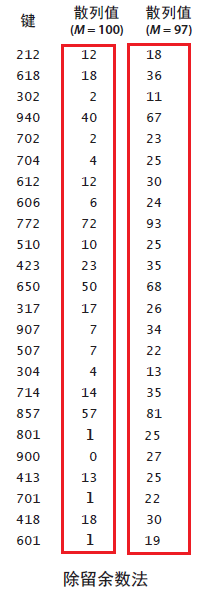

# 散列表

用算术操作将键转化为数组的索引来访问数组中的键值对。

散列的查找算法分为两步。
1. 散列函数将被查找的键转化为数组的一个索引。
2. 处理碰撞冲突：拉链法和线性探测法。

散列表是算法时空权衡的经典例子。
- 如果没有内存限制，直接将键作为（可能超大，想象一个String类型的key值为4733344）数组的索引，所有查找只需访问内存一次即可完成。
- 如果没有时间限制，使用无序数组进行顺序查找，只需要很少的内存。

散列表的核心问题还是要解决碰撞。不同的key可能会被映射到同一个hash值。

散列表可以实现在一般应用中（均摊后）常数级别的查找和插入操作的符号表。

## 散列函数
如果有一个能够保存M个键值对的数组，需要一个能够将任意键转化为该数组范围内的索引（[0,M-1] 范围内的整数）的散列函数。

### key为整数
除留余数法：对于任意正整数k，计算k 除以M 的余数，即k % M，结果必然落于[0,M-1]之间。

除留余数法的缺点：
假设键为电话号码的区号且M=100。假设区号中间位都是0 或者1，此方法会将大量的键散列为小于20 的索引，但如果使用素数
97，散列值的分布显然会更加均匀。



### key为浮点数
如果键是0 到1 之间的实数，将它乘以M并四舍五入得到一个0 至 M-1 之间的索引值。
但这种情况下键的高位起的作用更大，最低位对散列的结果没有影响。

修正办法是将键表示为二进制数，削弱高位的贡献作用，然后再使用除留余数法。

### key为字符串
将字符串形式的键当作大整数。
```java
int hash = 0;
for (int i = 0; i < s.length(); i++)
    hash = (R * hash + s.charAt(i)) % M;
```
Java 的charAt() 函数能够返回一个char 值，即非负16 位整数。这种计算相当于将字符串当作一个N 位的R 进制值，将它除以M 并取余。
R的选取要使用较小的素数，例如31，保证不溢出，就可以保证字符串中的所有字符都能发挥作用。
Java 的String 的默认实现使用了一个类似的方法: hash = (31 * hash + s.charAt(i))

### 组合键
如果键的类型含有多个整型变量，例如Date，含有几个整型域：day，month 和 year。可以使用
```java
int hash = (((day * R + month) % M ) * R + year) % M;
```

### 将hashCode()返回值转化为一个数组索引
```java
private int hash(Key x) {
    return (x.hashCode() & 0x7fffffff) % M;
}
```
& 0x7fffffff 表示忽略最高位（符号位），视为31位无符号整数，然后用除留余数法计算它除以M 的余数。

### 软缓存
使用hash变量来缓存每一个键的hashCode()计算值。这样，第一次计算后，后续请求就能直接取到值。Java中String类型为不可变final，使用了这种方式。