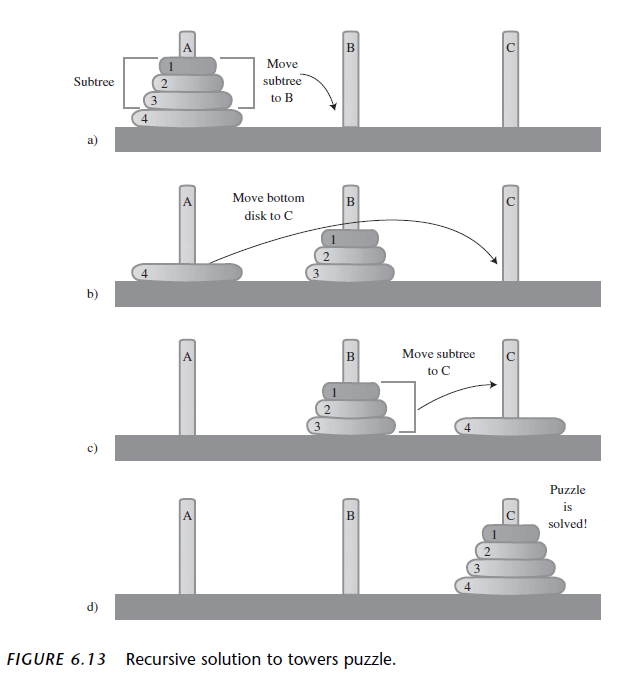
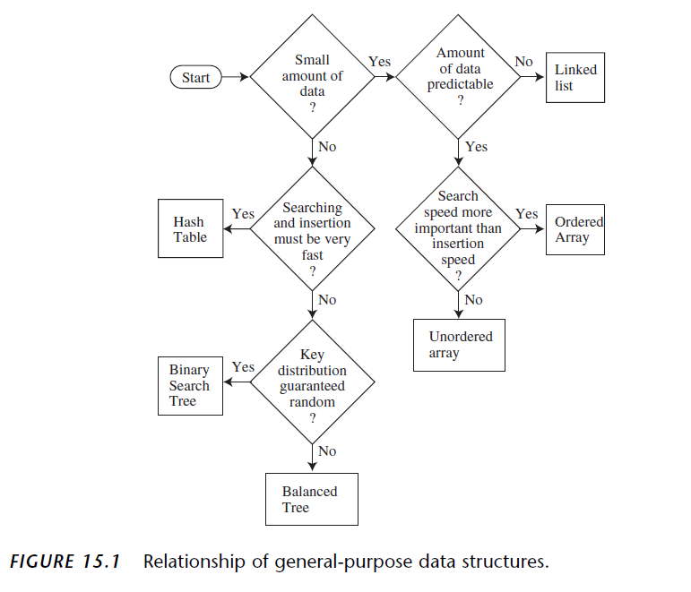
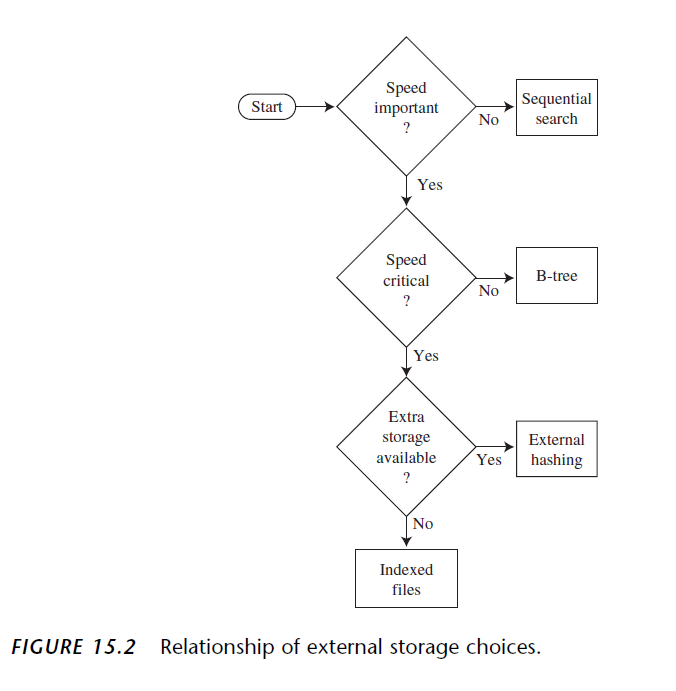

# 数据结构的特点

| 数据结构        | 优点                                                         | 缺点                                    |
| --------------- | ------------------------------------------------------------ | --------------------------------------- |
| Unordered Array | Quick insert, very fast access by index                      | Slow search,slow deletion,fixed size.   |
| Ordered Array   | Quicker search than unsorted array                           | Slow insertion,slow deletion,fixed size |
| Stack           | FILO access                                                  | Slow to access other items              |
| Queue           | FIFO access                                                  | Slow to access other items              |
| Linked List     | Quick insertion，quick deletion                              | Slow Search                             |
| Binary Tree     | Quick search，quick insert，quick delete（if tree remains balanced) | delete algorithm is very complex        |
| Red-black tree  | Quick search，quick insert，quick delete                     | Complex                                 |
| 2-3-4 tree      | Quick search，quick insert，quick delete                     | Complex                                 |
| Hash Table      | Quick access by key，fast insert                             | slow delete，inefficient memory usage   |
| Heap            | Quick insert，delete                                         | Slow to access other items              |
| Graph           | Model real world situations                                  | Some algorithms are slow and complex    |

## Implementation

### Sorted List

- array => SortedArrayList.java
- linked list => SortedLinkedList.java insert is faster than SortedArrayList.java

### Stack

- array => ArrayStack.java
- linked list => LinkedListStack.java

### queue

- array => ArrayQueue.java

- two stack => TwoStackQueue.java
- linked list => LinkedListQueue.java

### priority queue

priority queue allows access to the smallest (or sometimes the largest) item

- array => ArrayPriorityQueue.java
- heap(better for quick insertion) => HeapPriorityQueue.java

### Circular queue

the Front and Rear arrows wrap around to the beginning of the array. The result
is a circular queue (sometimes called a ring buffer).

=> ArrayCircularQueue.java

### Deque

double ended queue is Deque. 

API：

- insertLeft()
- insertRight()
- removeLeft()
- removeRight()

Doubly Linked List as Basis for Deques => Deque.java

### Parsing Arithmetic Expressions

1. Transform the arithmetic expression into a different format, called postfix notation.
2. Evaluate the postfix expression

- Ordinary arithmetic expressions are written in infix notation, so-called because the
  operator is written between the two operands. 
- In postfix notation, the operator follows the two operands. 
- A stack is a useful tool both for translating an infix to a postfix expression and for
  evaluating a postfix expression.

### Simple linked list

> SimpleLinkedList

- Inserting an item at the beginning of the list

- Deleting the item at the beginning of the list
  
- Iterating through the list to display its contents

### Double ended list

> DoubledEndedList

A double-ended list maintains a pointer to the last link in the list, often called
last, as well as to the first.

A double-ended list allows insertion at the end of the list.

### Double linked list

> DoubleLinkedList

features：

- To conveniently delete the
  last link

- traverse backward

### Interator

An iterator is a reference, encapsulated in a class object, that points to a link in
an associated list.

### Recursion

- 退出条件 base case
- 递归条件

#### Anagrams

字谜。数学中的排列问题。注意不是组合。

Anagramming cat

- cat
- cta
- atc
- act
- tca
- tac

How would you write a program to anagram a word? Here’s one approach. Assume
the word has n letters.

1. Anagram the rightmost n-1 letters.
2. Rotate all n letters.
3. Repeat these steps n times.

Rotating the word n times gives each letter a chance to begin the word.

#### 汉诺塔
The solution to the Towers of Hanoi puzzle can be expressed recursively using the
notion of subtrees. Suppose you want to move all the disks from a source tower (call
it S) to a destination tower (call it D). You have an intermediate tower available (call
it I). Assume there are n disks on tower S. Here’s the algorithm:

1. Move the subtree consisting of the top n-1 disks from S to I.
2. Move the remaining (largest) disk from S to D.
3. Move the subtree from I to D.

```
A  B  C
```
As it turns out, moving three disks from A to the destination tower B can be done
with the same three steps as moving four disks. That is, move the subtree consisting
of the top two disks from tower A to intermediate tower C; then move disk 3 from A
to B. Then move the subtree back from C to B.

How do you move a subtree of two disks from A to C? Move the subtree consisting
of only one disk (1) from A to B. This is the base case: When you’re moving only one
disk, you just move it; there’s nothing else to do. Then move the larger disk (2) from
A to C, and replace the subtree (disk 1) on it.



```java
class TowersApp
{
static int nDisks = 3;
public static void main(String[] args)
{
doTowers(nDisks, ‘A’, ‘B’, ‘C’);
}
//-----------------------------------------------------------
public static void doTowers(int topN,
char from, char inter, char to)
{
if(topN==1)
System.out.println(“Disk 1 from “ + from + “ to “+ to);
else
{
doTowers(topN-1, from, to, inter); // from-->inter
System.out.println(“Disk “ + topN +
“ from “ + from + “ to “+ to);
doTowers(topN-1, inter, from, to); // inter-->to
}
}
//----------------------------------------------------------
} // end class TowersApp
```

### Huffman tree
A Huffman tree is a binary tree (but not a search tree) used in a data-compression
algorithm called Huffman Coding.

In the Huffman code the characters that appear most frequently are coded with
the fewest bits, and those that appear rarely are coded with the most bits.

## When to Use What
- General-purpose data structures: arrays, linked lists,
trees, hash tables
- Specialized data structures: stacks, queues, priority
queues, graphs
- Sorting: insertion sort, Shellsort, quicksort, mergesort,
heapsort
- Graphs: adjacency matrix, adjacency list
- External storage: sequential storage, indexed files,
B-trees, hashing



General-Purpose Data Storage Structures

| Data Structure                        | Search  | Insertion | Deletion | Traversal |
| ------------------------------------- | ------- | --------- | -------- | --------- |
| Array                                 | O(N)    | O(1)      | O(N)     | -         |
| Ordered array                         | O(logN) | O(N)      | O(N)     | O(N)      |
| Linked list                           | O(N)    | O(1)      | O(N)     | -         |
| Ordered linked list                   | O(N)    | O(N)      | O(N)     | O(N)      |
| Binary tree (average)                 | O(logN) | O(logN)   | O(logN)  | O(N)      |
| Binary tree (worst case)              | O(N)    | O(N)      | O(N)     | O(N)      |
| Balanced tree(average and worst case) | O(logN) | O(logN)   | O(logN)  | O(N)      |
| Hash table                            | O(1)    | O(1)      | O(1)     |           |

Special-Purpose Structures

| Data Structure                 | Insertion | Deletion | Comment                              |
| ------------------------------ | --------- | -------- | ------------------------------------ |
| Stack (array or linked list)   | O(1)      | O(1)     | Deletes most recently inserted item  |
| Queue (array or linked list)   | O(1)      | O(1)     | Deletes least recently inserted item |
| Priority queue (ordered array) | O(N)      | O(1)     | Deletes highest-priority item        |
| Priority queue (heap)          | O(logN)   | O(logN)  | Deletes highest-priority item        |



