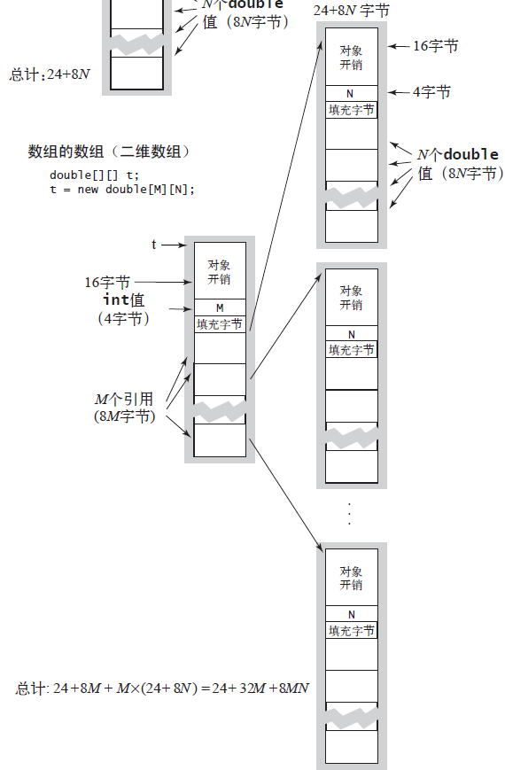

# Java Code 内存占用
## 对象
### Integer
```java
public class Integer
{
    private int x;
}
```
一个 Integer 对象会使用24 字节
- 16 字节的对象开销
- 4 字节用于保存它的 int 值 x
- 4 个填充字节

### Date
```java
public class Date
{
    private int day;
    private int month;
    private int year;
}
```
一个 Date 对象需要使用32 字节：
- 16 字节的对象开销
- 3 个int 实例变量各需 4 字节，一共 12 字节
- 4 个填充字节

### Counter
```java
public class Counter
{
    private String name;
    private int count;
}
```
一个 Counter 对象需要使用32 字节：
- 16 字节的对象开销
- 8 字节用于它的String 型实例变量（一个引用）
- 4 字节用于int 实例变量
- 4 个填充字节

### Node
```java
public class Node
{
    private Item item;
    private Node next;
}
```
> Node 是嵌套的非静态（内部）类

一个 Node 对象需要使用40 字节
- 16 字节的对象开销
- 指向 Item 和 Node对象的引用各需8 字节，即 16 字节
- 8 字节的额外开销，用于一个指向外部类的引用

## 数组
### int [N]


### double [N]


### Date [N]


### double [M][N]


### 小结
|类型 |字节数|
|---|---|
|int[]| ~4N|
|double[] |~8N|
|Date[]| ~40N|
|double[][]| ~8NM|

## 字符串对象
```java
public class String
{
    private char[] value;
    private int offset;
    private int count;
    private int hash;
    ...
}
```
每个String 对象总共会使用40字节
- 16 字节表示对象
- 三个int 实例变量各需4 字节
- 数组引用的 8 字节
- 4 个填充字节

这是除字符数组(char [])之外字符串所需的内存空间，字符数组所需内存需要另记，因为String 的char数组常常在多个字符串之间共享。

## 字符串的值和子字符串
一个长度为N 的String 对象一般需要使用40 字节（String 对象本身）加上（24+2N）字节（字符数组），总共（64+2N）字节。
> 24 = 16（char [] 对象开销）+ 8(引用)

```
String genome = "CGCCTGGCGTCTGTAC";
String codon = genome.substring(6, 3);
```
调用substring() 方法时，创建了一个新的 String 对象（40 字节），但它重用了相同的value[] 数组，因此该字符串的子字符串只会使用40 字
节的内存。含有原始字符串的字符数组的别名存在于子字符串中，子字符串对象的偏移量和长度域标记了子字符串的位置。
