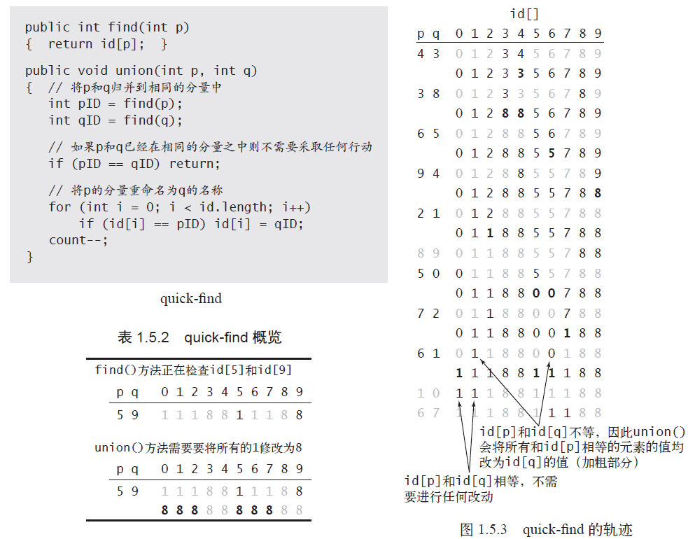
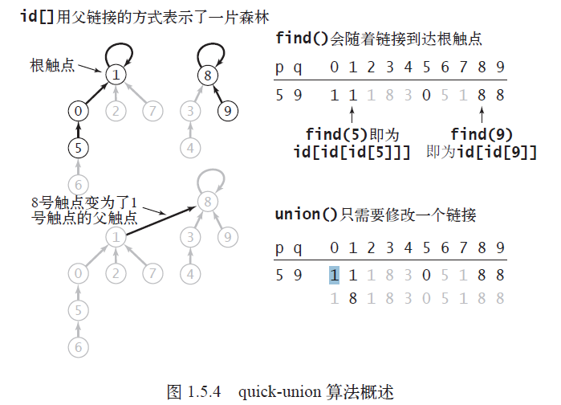
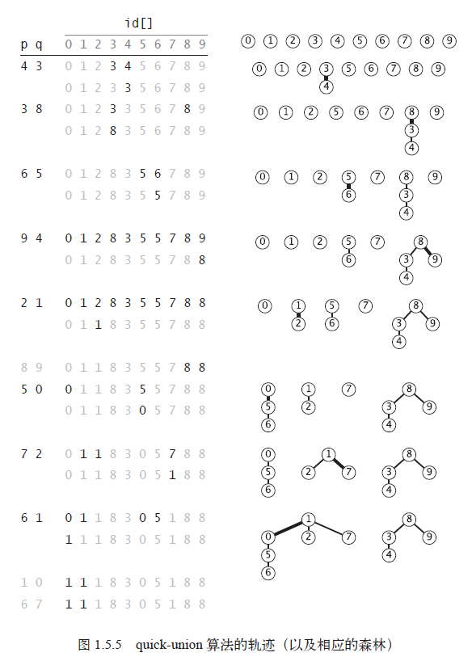
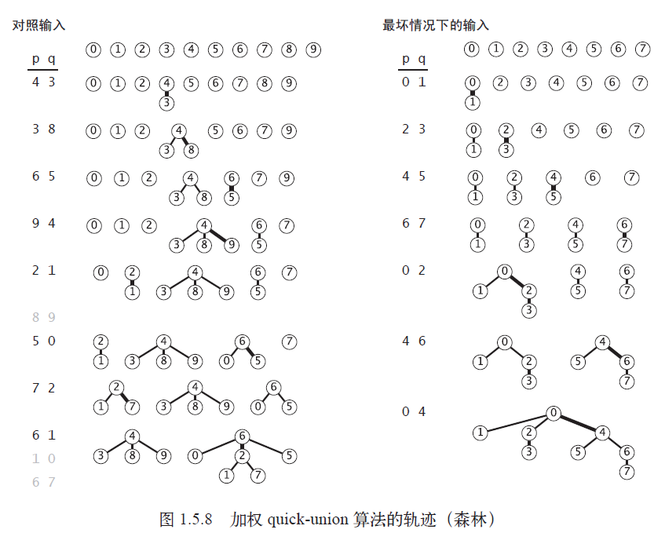

# Union Find
## quick find

## quick union

## 加权 quick union

## union-find 算法的性能特点

| 算法                      | 构造函数 | union() | find()   |
| ------------------------- | -------- | ------- | -------- |
| quick-find                | N        | N       | 1        |
| quick-union               | N        | 树高度  | 树高度   |
| 加权 quick-union          | N        | lgN     | lgN      |
| 路径压缩的加权quick-union | N        | 接近1   | 均摊成本 |

